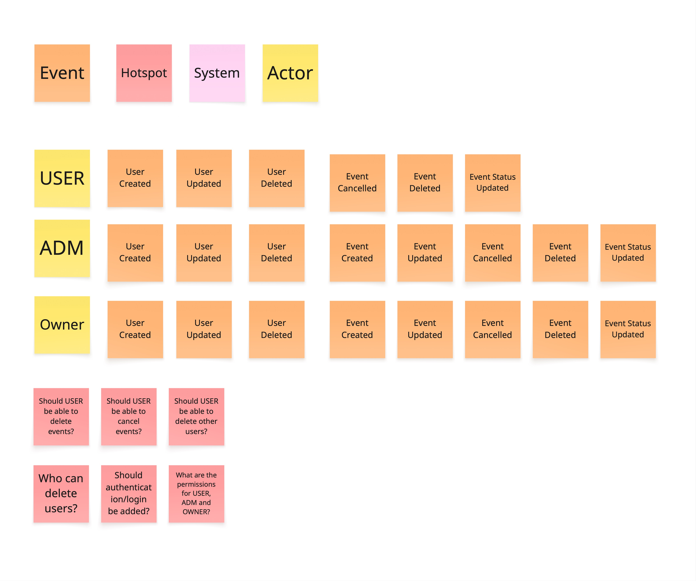
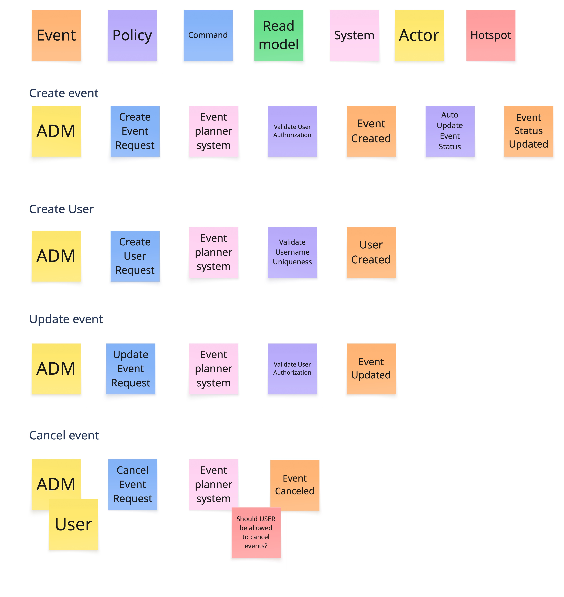
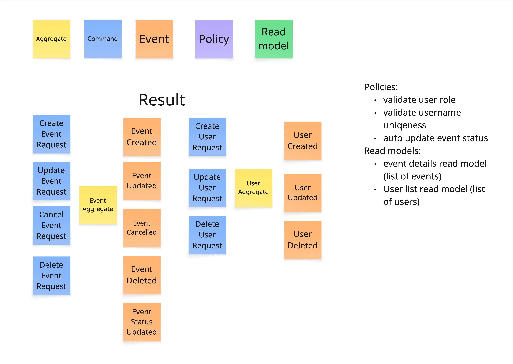
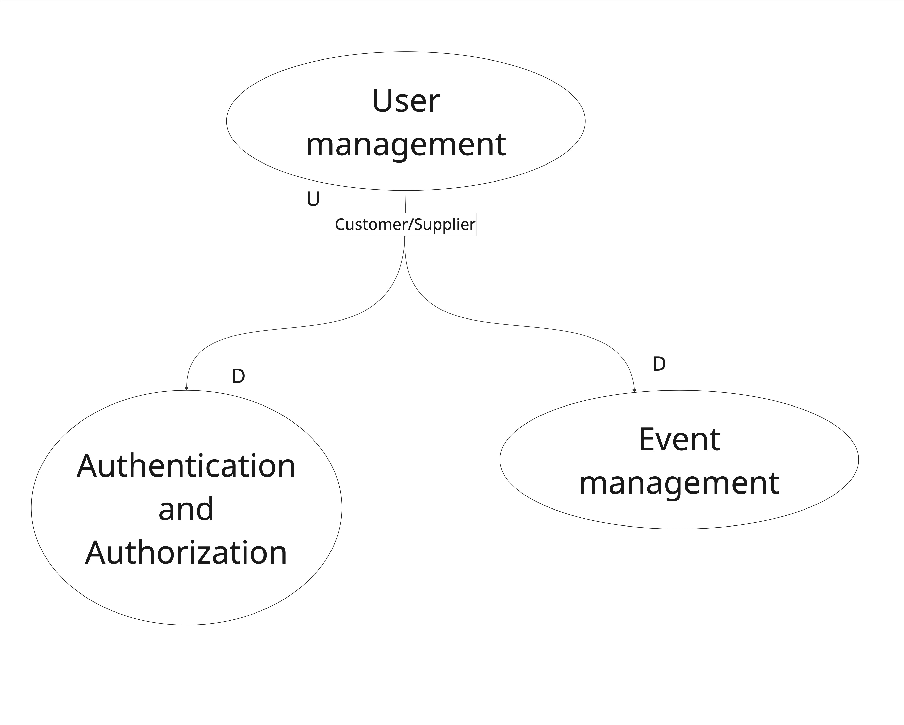

# Assignment 2 - Event Storming

## 1. Big Picture Event Storming

### Big Picture Notes
The Big Picture diagram represents the current application behavior.
At the moment, role restrictions are not fully implemented in the current application. Some actions already have restrictions, but a USER can still perform actions that normally should require higher permissions, such as deleting events and managing users.
Hotspots were added to identify current design issues and possible future improvements, such as authentication and role-based permissions.

## 2. Process Modeling

## 3. Software Design

## Domain Design

The current application is built as one system where event management and user management are connected together.
During the software design phase, different domains and aggregates were identified to make the application easier to 
maintain, extend, and possibly split into separate services in the future.

### Event Management Domain
This domain is responsible for all event related functionality.

#### Responsibilities
- Create event
- Update event
- Cancel event
- Delete event
- Update event status

#### Aggregate Root
- Event

#### Commands
- CreateEventRequest
- UpdateEventRequest
- CancelEventRequest
- DeleteEventRequest

#### Events
- EventCreated
- EventUpdated
- EventCancelled
- EventDeleted
- EventStatusUpdated

#### Possible Value Objects
- EventDate
- EventLocation
- EventDescription
- EventStatus

---

### User Management Domain

This domain is responsible for user related functionality.

#### Responsibilities
- Create user
- Update user
- Delete user
- Manage user roles

#### Aggregate Root
- User

#### Commands
- CreateUserRequest
- UpdateUserRequest
- DeleteUserRequest

#### Events
- UserCreated
- UserUpdated
- UserDeleted

#### Possible Value Objects
- Username
- Password
- UserRole

---

### Authentication and Authorization Domain

This domain is responsible for authentication and permissions.
This functionality does not fully exist yet in the current application, but it was identified as an important future domain.

#### Responsibilities
- Login
- Authentication
- Permission validation
- Session management

#### Possible Aggregate Root
- AuthenticationUser

#### Possible Value Objects
- Credentials
- Token
- Session

---

### Future Distributed Architecture

The domains could later be separated into different services.

This would make it possible to use:
- messaging
- asynchronous communication
- event driven communication
- independent scaling of services

Examples:
- `UserCreated` event could be used by another service
- `EventCancelled` could trigger notifications

To support this architecture, services should communicate using IDs instead of direct entity references.

## 4. Living Glossary
# Living Glossary

| Field | Content |
|---|---|
| **Term** | Event |
| **Definition** | An activity planned by a user or administrator with a date, location, description, and status. |
| **Context(s)** | Event Management Domain |
| **Invariants** | - An event must have a name. - An event must have a valid date. - An event must belong to a user. - An event status must be `PLANNED`, `COMPLETED`, or `CANCELLED`. |
| **Explicit NOT** | - It is not a user account. - It is not an authentication session. - It is not a notification system. |

---

| Field | Content |
|---|---|
| **Term** | User |
| **Definition** | A person who can manage or interact with events in the application. |
| **Context(s)** | User Management Domain |
| **Invariants** | - A user must have a unique username. - A user must have a role. - A role must be `USER`, `ADM`, or `OWNER`. |
| **Explicit NOT** | - It is not an event. - It is not a login token. - It is not a permission rule itself. |

---

| Field | Content |
|---|---|# Assignment 2 - Event Storming

## 1. Big Picture Event Storming

### Big Picture Notes
The Big Picture diagram represents the current application behavior.
At the moment, role restrictions are not fully implemented in the current application. Some actions already have restrictions, but a USER can still perform actions that normally should require higher permissions, such as deleting events and managing users.
Hotspots were added to identify design issues and future improvements, such as authentication and role-based permissions.

## 2. Process Modeling

## 3. Software Design

## Domain Design

The current application is built as one system where event management and user management are connected together.
During the software design phase, different domains and aggregates were identified to make the application easier to
maintain, extend, and possibly split into separate services in the future.

### Event Management Domain
This domain is responsible for all event related functionality.

#### Responsibilities
- Create event
- Update event
- Cancel event
- Delete event
- Update event status

#### Aggregate Root
- Event

#### Commands
- CreateEventRequest
- UpdateEventRequest
- CancelEventRequest
- DeleteEventRequest

#### Events
- EventCreated
- EventUpdated
- EventCancelled
- EventDeleted
- EventStatusUpdated

#### Possible Value Objects
- EventDate
- EventLocation
- EventDescription
- EventStatus

---

### User Management Domain

This domain is responsible for user related functionality.

#### Responsibilities
- Create user
- Update user
- Delete user
- Manage user roles

#### Aggregate Root
- User

#### Commands
- CreateUserRequest
- UpdateUserRequest
- DeleteUserRequest

#### Events
- UserCreated
- UserUpdated
- UserDeleted

#### Possible Value Objects
- Username
- Password
- UserRole

---

### Authentication and Authorization Domain

This domain is responsible for authentication and permissions.
This functionality does not fully exist yet in the current application, but it was identified as an important future domain.

#### Responsibilities
- Login
- Authentication
- Permission validation
- Session management

#### Possible Aggregate Root
- AuthenticationUser

#### Possible Value Objects
- Credentials
- Token
- Session

---

### Future Distributed Architecture

The domains could later be separated into different services.

This would make it possible to use:
- messaging
- asynchronous communication
- event driven communication
- independent scaling of services

Examples:
- `UserCreated` event could be used by another service
- `EventCancelled` could trigger notifications

To support this architecture, services should communicate using IDs instead of direct entity references.

## 4. Living Glossary
# Living Glossary

| Field | Content |
|---|---|
| **Term** | Event |
| **Definition** | An activity planned by a user or administrator with a date, location, description, and status. |
| **Context(s)** | Event Management Domain |
| **Invariants** | - An event must have a name. - An event must have a valid date. - An event must belong to a user. - An event status must be `PLANNED`, `COMPLETED`, or `CANCELLED`. |
| **Explicit NOT** | - It is not a user account. - It is not an authentication session. - It is not a notification system. |

---

| Field | Content |
|---|---|
| **Term** | User |
| **Definition** | A person who can manage or interact with events in the application. |
| **Context(s)** | User Management Domain |
| **Invariants** | - A user must have a unique username. - A user must have a role. - A role must be `USER`, `ADM`, or `OWNER`. |
| **Explicit NOT** | - It is not an event. - It is not a login token. - It is not a permission rule itself. |

---

| Field | Content |
|---|---|
| **Term** | Event Status |
| **Definition** | The current state of an event. |
| **Context(s)** | Event Management Domain |
| **Invariants** | - Status can only be `PLANNED`, `COMPLETED`, or `CANCELLED`. - Cancelled events cannot automatically become completed. |
| **Explicit NOT** | - It is not the event date. - It is not the user role. |

---

| Field | Content |
|---|---|
| **Term** | User Role |
| **Definition** | Defines what actions a user is allowed to perform in the system. |
| **Context(s)** | User Management Domain, Authentication Domain |
| **Invariants** | - Role can only be `USER`, `ADM`, or `OWNER`. - A normal `USER` cannot manage events. |
| **Explicit NOT** | - It is not an event status. - It is not a user identity. |

---

| Field | Content |
|---|---|
| **Term** | Authentication |
| **Definition** | The process of validating a user before giving access to the system. |
| **Context(s)** | Authentication and Authorization Domain |
| **Invariants** | - A user must provide valid credentials. - Authentication data must belong to an existing user. |
| **Explicit NOT** | - It is not user management. - It is not event management. |

## 5. Context Map Diagram

### Relationship explanation
User Management acts as the upstream context and provides user information.
Authentication and Authorization acts as a downstream context because it requires user information for login and permission validation.
Event Management acts as a downstream context because event creation and management depend on user information and permissions.
Customer/Supplier was selected because the contexts are developed together and changes can be coordinated between teams.
| **Term** | Event Status |
| **Definition** | The current state of an event. |
| **Context(s)** | Event Management Domain |
| **Invariants** | - Status can only be `PLANNED`, `COMPLETED`, or `CANCELLED`. - Cancelled events cannot automatically become completed. |
| **Explicit NOT** | - It is not the event date. - It is not the user role. |

---

| Field | Content |
|---|---|
| **Term** | User Role |
| **Definition** | Defines what actions a user is allowed to perform in the system. |
| **Context(s)** | User Management Domain, Authentication Domain |
| **Invariants** | - Role can only be `USER`, `ADM`, or `OWNER`. - A normal `USER` cannot manage events. |
| **Explicit NOT** | - It is not an event status. - It is not a user identity. |

---

| Field | Content |
|---|---|
| **Term** | Authentication |
| **Definition** | The process of validating a user before giving access to the system. |
| **Context(s)** | Authentication and Authorization Domain |
| **Invariants** | - A user must provide valid credentials. - Authentication data must belong to an existing user. |
| **Explicit NOT** | - It is not user management. - It is not event management. |

- A normal USER currently has limited restrictions implemented.
- Future implementation should limit USER permissions.

## 5. Context Map Diagram

### Relationship explanation
User Management acts as the upstream context and provides user information.
Authentication and Authorization acts as a downstream context because it requires user information for login and permission validation.
Event Management acts as a downstream context because event creation and management depend on user information and permissions.
Customer/Supplier was selected because the contexts are developed together and changes can be coordinated between teams.
Currently these domains are implemented in a single application, but they were separated conceptually to support possible future microservice architecture.